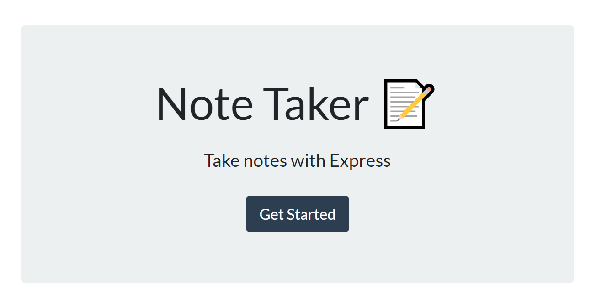
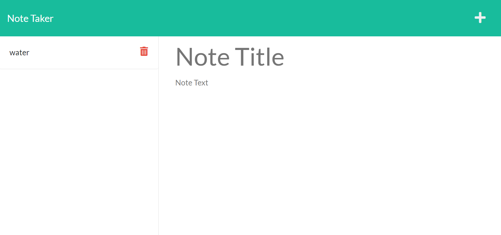
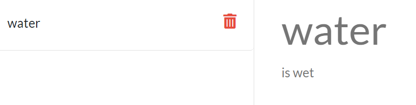
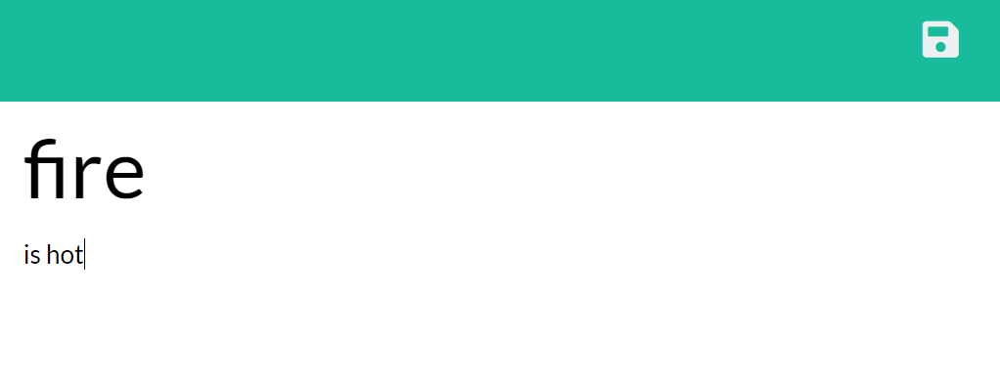
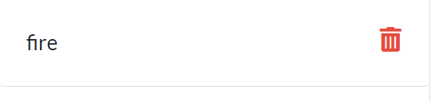

# Note Taker

## Useage
Upon loading the note taker the user will be greeted with a homepage that has a button to get started
<br.>
*image of the homepage*

Once the user clicks on the "Get Started" button, they will be taken to the note page. Any previously saved notes will populate on the left hand column, and they will also see placeholder text for a note title and note text. 
 

If the user clicks on an old note, the placeholder text will be replaced with the appropriate note title and note text. 
 
*Upon clicking the water note, the user will see that water is indeed wet*

The user needs to click on the "plus" symbol in order to create a new note, upon clicking the button the placeholder text for generating a new note will re-populate.
 

Once the user has completed writing a new note, they will be able to click the save icon that generates in order to save their note. 
 

Once the note is saved, the user will see the note populate on the bottom of the list of notes.
 

## Links
[Github Repo](https://github.com/Chapjae/svg-logomaker)
[Heroku Deployment](https://secure-springs-65032-2df5e9debe1e.herokuapp.com/)
[LinkedIn](https://www.linkedin.com/in/jay-liu-3208a3bb/)

## Technologies Used
HTML  
Javascript  
CSS  
Node.js  
express.js 